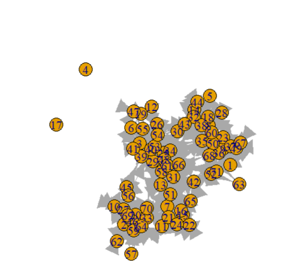
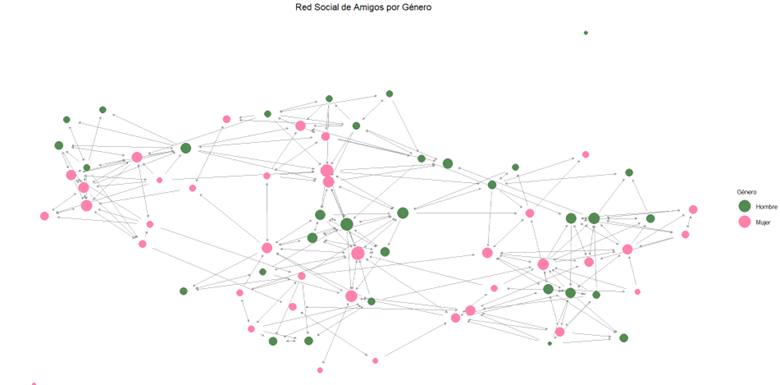
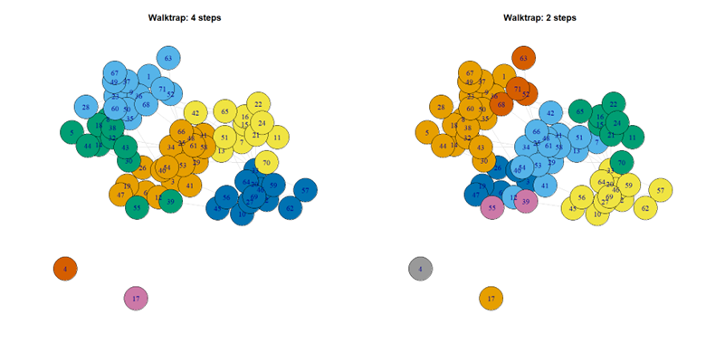

<h1 align="center"> Análisis de Redes Sociales en Adolescentes - Estudio Add Health </h1>

   

# Tabla de contenidos
* [Introducción](#introducción)
* [Contexto del estudio](#contexto-del-estudio)
* [Objetivos del análisis](#objetivos-del-análisis)
* [Metodología](#metodología)
* [Resultados clave](#resultados-clave)
* [Tecnologías utilizadas](#tecnologías-utilizadas)
* [Aplicaciones potenciales](#aplicaciones-potenciales)

# Introducción
Este proyecto realiza un análisis de redes sociales utilizando datos del estudio longitudinal **Add Health** (National Longitudinal Study of Adolescent to Adult Health), enfocado en entender las dinámicas de amistad y actividades sociales en adolescentes estadounidenses.

# Contexto del estudio
El estudio Add Health recopiló información de más de 20,000 adolescentes entre 1994-1995, con seguimientos hasta 2018. Los datos de redes sociales incluyen:
- Nominaciones de hasta 5 amigos masculinos y 5 femeninos
- Actividades sociales realizadas (visitas, reuniones, llamadas)
- Atributos demográficos (género, raza, escuela)

# Objetivos del análisis
1. Visualizar la estructura de la red social
2. Calcular métricas de centralidad (grado, intermediación)
3. Identificar comunidades dentro de la red
4. Analizar relación entre atributos demográficos y posición en la red

# Metodología
El análisis se desarrolló en 6 etapas principales:

1. **Carga de datos**  
   - Archivos: `taller_edgelist.csv` (conexiones) y `taller_atributos.csv` (características nodos)
   
2. **Creación del objeto de red**  
   - Uso del paquete `igraph` en R
   - Asignación de atributos a nodos

3. **Visualización básica**  
   - Sociograma inicial
     

  

4. **Visualización mejorada**  
   - Tamaño de nodos por grado
   - Color por genero
       

  

En el sociograma, se puede notar que los nodos femeninos (en rosa) tienden a estar más conectados entre sí,
lo que sugiere que las mujeres forman una red de amigas más sólida en comparación con las conexiones entre hombres (en verde).
Esto podría reflejar una dinámica de género donde las mujeres tienden a construir amistades más cercanas.
   
4. **Métricas de centralidad**  
   - Cálculo de grado (degree) y betweenness
   - Densidad de la red

   Los valores varían desde 0 hasta 22. Los nodos con los grados más altos tienen 15, 19, y 22 conexiones.
   Estos nodos actúan como centros de actividad dentro de la red, ya que tienen muchas conexiones directas con otros nodos. 
   Por otro lado, algunos nodos tienen grado 0, lo que significa que no tienen conexiones directas.

   Grado promedio: El grado promedio de 8.59 indica que, en promedio, cada nodo tiene alrededor de 8 conexiones directas 
   en la red. Esto nos da una idea general de cuán conectada está la red.

6. **Detección de comunidades**  
   - Algoritmo Walktrap
   - Visualización de clusters
       

  

En la visualización correspondiente a 4 pasos, se observan 7 comunidades, de las cuales 5 son de gran tamaño, 
mientras que las otras 2 están desconectadas y consisten en un solo nodo cada una.
Por otro lado, al analizar el gráfico de 3 pasos, se identifican alrededor de 8 comunidades,
de las cuales 5 también son de gran tamaño. Sin embargo, entre las otras 3, dos se encuentran aisladas y consisten 
en un solo nodo, mientras que la última comprende solo dos nodos.

# Resultados clave
- Los análisis realizados sugieren que la red social tiene una estructura de baja densidad y alta vulnerabilidad, 
lo que implica que contiene subgrupos o comunidades que se mantienen conectados a través de unos pocos nodos o "puentes"
críticos. Esto significa que ciertos nodos son clave para mantener la cohesión de la red, y resulta fundamental identificar 
estos nodos de influencia, así como comprender cómo podría fragmentarse la red si algunos de ellos se desconectaran.
- La red tiene una baja densidad, lo que sugiere que no todos los nodos están interconectados. 
Sin embargo, hay ciertos nodos con alta centralidad de grado e intermediación, 
lo que implica que estos nodos son muy influyentes dentro de la red. Los nodos con alta intermediación
controlan un flujo de información importante entre diferentes partes de la red, mientras que los nodos 
con alto grado de centralidad probablemente tengan una gran visibilidad o popularidad.

### Insights
- Los estudiantes de mayor grado controlan el flujo de información entre las distintas comunidades
- Las mujeres muestran mayor diversidad en conexiones
- Los nodos centrales (de mayor grado) son fundamentales para mantener la red conectada.

# Tecnologías utilizadas
**Lenguaje y herramientas**  
  

**Paquetes principales**

- igraph (análisis de redes)
- ggplot2 (visualizaciones)
- dplyr (manipulación de datos)
-Walktrap (deteccion de comunidades)
# Aplicaciones potenciales
- Diseño de programas escolares contra el bullying
- Identificación de estudiantes en riesgo social
- Optimización de estrategias de intervención comunitaria

# Repositorio
- 📌 Repositorio del proyecto: [Proyecto Análisis de Redes](https://github.com/CamiiloP14/Analisis-de-Redes-Sociales)
- 📧 Contacto: cpedreros488@gmail.com
- 🔗 LinkedIn: [Camilo Pedreros](https://www.linkedin.com/in/camilo-pedreros-106a1a245/)
